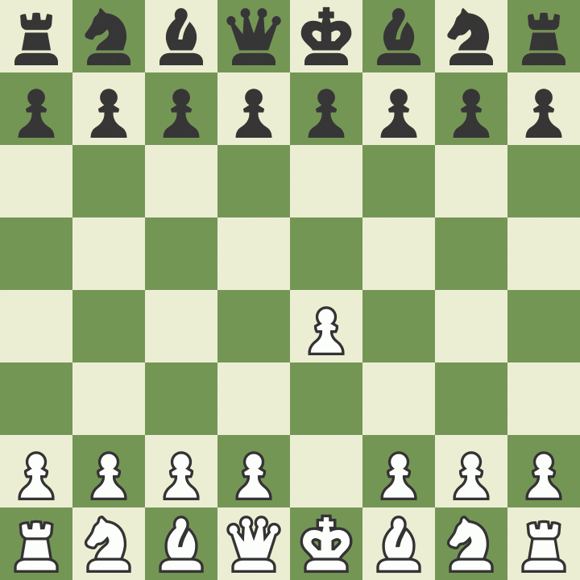

Building a chess bot is an interesting endeavor, and having recently learnt Rust, I had the perfect excuse to build one. This started as a private hobby project, but then I decided to build in the open!

So far, I have:

- Implemented the movements for each chess piece.
- Built a bot that looks one step ahead and picks a move based on material advantage and piece activity.
- Created a basic terminal UI to play against the robot.

This video is a demo of a game I played against the robot. Although I didn't reach checkmate, the bot has no understanding of checks, so i captured its king on the next round.

I’ll be sharing updates I make to the bot and new games to show how it’s improving!

