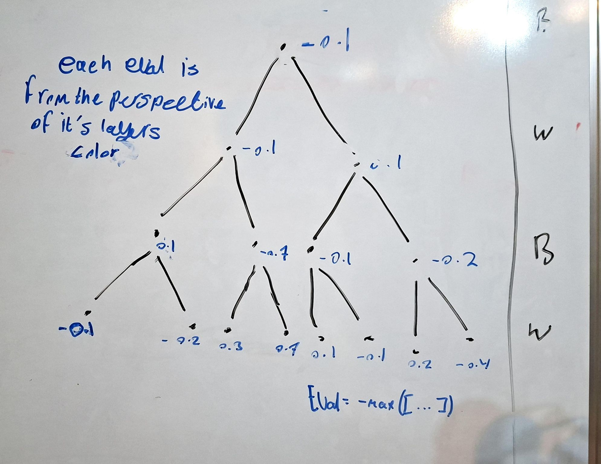

Arguably the thing that makes computers so good at playing chess is their ability to look many moves into the future and pick the best positions, taking advantage of computational strength to mimic having a plan to reach checkmate; hence, I must implement that into my bot!

This is achieved through a recursive algorithm, which takes in a depth and a current position as input. All proceeding possible positions are generated. For each of those, the next positions are generated recursively for the aforementioned depth. This generates a tree of possible proceeding positions, with the root of each as a possible next move the bot could immediately play, and each node as a possible proceeding position from its parent.

The leaves are evaluated based on a weighted equation. The evaluations are bubbled up the tree until the root. This determines how good the move is. The bot chooses the move with the highest evaluation to play next.  
The evaluation of each non-leaf node is negative the maximum of its children's evaluations. This is because from White's perspective, the evaluation of a position is as bad as the best-case scenario for Black on his next move.

This algorithm worked! The bot plays smarter now, though very slowly. For depth=2 (which is very low), it takes more than a minute for the bot to play its first move. The next step would be to find a way to make the algorithm faster somehow.

