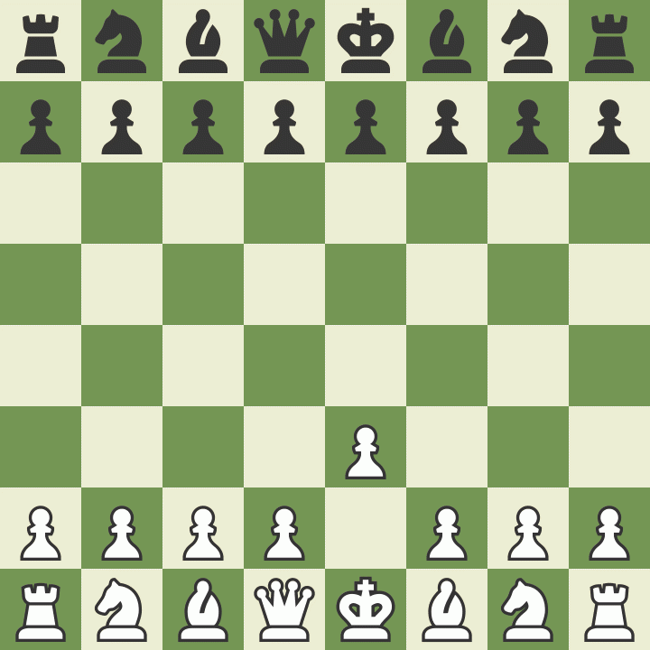

Last time, I was able to make the bot go smarter by implementing recursive search through possible future positions, but the algorithm was too slow even at `depth=2`. So right after, I started working on making the bot faster! 

I landed on pararellism as a solution. I was going through the [Tokio](https://tokio.rs) docs in preparation to download it when I met a line that said something like "If your application is CPU bound, consider using Rayon."

And I was thankful for having [started reading about CPU virtualisation](/journals/learning-os#4). 

What this is trying to say is that Tokio is best used for when you have an application that does a lot of waiting on I/O, like a server or a GUI. These are called I/O bound applications. They are limited by how fast they can get their I/O requests fulfilled. Other types programs which do more computations but need minimal I/O are called CPU bound. These applications will run faster if they have longer access to the CPU. A perfect example of this is my chess bot. 

In the case of CPU bound programs, the docs are directing us to use [Rayon](https://docs.rs/rayon/latest/rayon/), another rust crate. 

After installing Rayon, I used their very simple parallel iterators to run searches through multiple positions in parallel. 

Now my bot responds within 2 secs for `depth=2`!

The bot is still slow for `depth=3` though, so I still ll have a lot of optimisation to do. And I have a plan for doing that should work though I'm not certain... 

