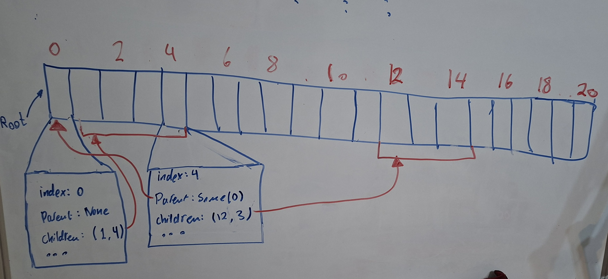

Last time, I explained how my cacheable implementation of the algorithm was, unfortunately, quite slow. So I tried to fix that.

Flame graphs would be a perfect tool for identifying the slowdown; however, the multithreaded nature of the program made using them quite hard. I looked into profiling and benchmarking via crates like [Rust Tracing](https://docs.rs/tracing/latest/tracing/), but that would require large changes to the codebase, so before doing that, I wanted to try general performance improvements.

What first came to mind was vector reallocations. I rewrote the algorithm so it reserves all the required space before expanding the tree. Additionally, I took advantage of the fact that the tree is generated breadth-first: all children are written to memory next to each other, so I could use a fat pointer to represent the children of a node instead of the vector of indices I was using.

I did this among other performance improvements, but to no avail. I asked an LLM with the full context of the repo to compare both old and new implementations of the algorithm, and it came up with a list of reasons why it was slower, but they mostly weren't actionable. Furthermore, I looked into [alpha-beta pruning](https://www.youtube.com/watch?v=l-hh51ncgDI)—a well-known method to speed up chess engines—and that required the tree to be built depth-first, not breadth-first, so my code and all optimizations I just built had to be scrapped.

And I had to start over, from square one, before implementing the cacheable data structure.