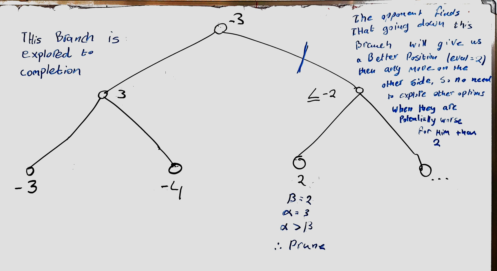
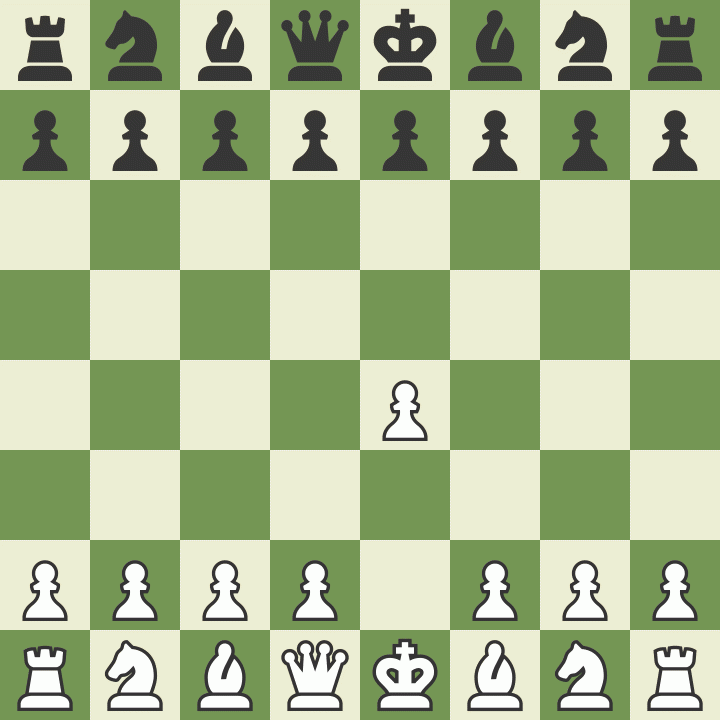

Ya... i threw away the memoisation component of my bot. Recreating the entire tree produces a faster result than keeping track of a tree data structure.

And for the headline... FINALLY, after much research and pondering tree graphs over my whiteboard, I have at last implemented Alpha-Beta Pruning. 

To understand the Alpha-Beta pruning (ABP), imagine the following : You're playing a chess match and are considering a particular move, let's say moving a pawn that's protecting your king. When you relies that your opponent might checkmate you on the next turn, does it make sense considering his other responses to that same move? Of course not! Instead, you should save time and think about other moves you could make. 

While not an exact analogy, this example captures the principle behind ABP; our opponent will not allow use to get a particular position if that position is better for us then another position he can push us into, hence we should not waste time exploring such options. 

I find the exact logic challenging though. I find it best to refer to [this video](https://youtu.be/l-hh51ncgDI?si=oKHbO_BTobaN48oD) (which i linked to multiple times in this series) when I trip over the logic. The implementation is slightly different for me, since I my search algorithm is technically *Negamax* not Minimax. I tried implementing it by hand, but ended up adapting [this implementation described on Wikipedia](https://en.wikipedia.org/wiki/Negamax#Negamax_variant_with_no_color_parameter).

This diagram kinda explains Alpha-beta pruning for Negamax algorithms

I made the robot play itself and measured how the time taken to complete a game compared to before Alpha-Beta pruning:

| Depth | Without ABP (s) | With ABP (s) | % increase |
| ----- | --------------- | ------------ | ---------- |
| 2     | 2.79            | 0.13         | 2146       |
| 3     | 120             | 1.63         | 7632       |
| 4     | Way too slow    | 17.4         | ∞          |

So yes, ABP was quite an effective optimisation.

Here is the game they played at `depth = 4`

Now sure, the game does look stupid, however I believe this is the fault of the static evaluater rather than the search algorithm. I do see it optimising for piece activity when black dove its king towards the center. That should be fixed later. The game ended in a draw, because the bot does not recognise repitions as draws; this is my immeadiate next step.

The final thing I might have time to do before collage is sharpening the static evaluater. I plan on doing this through an evolutionary algorithm. I don't know how I'll do that but we'll see.