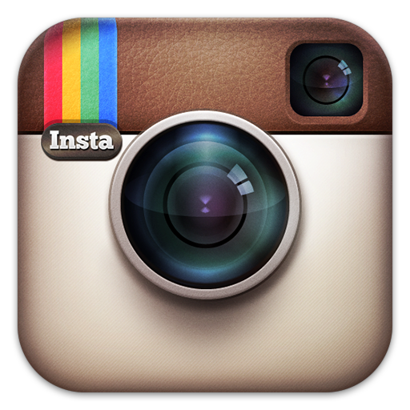

It's often hard for us to do the things we want to do, even if we like them. Instead we find ourselves scrolling Facebook, and at the end of the day we might feel disappointed that we didn't get to read the new books we bought, but somehow we spent 4 hours on Tiktok. This is friction in action.

## What is friction
I like to define friction as "the amount of stuff between me wanting to do something, and me actually doing it". The more stuff in between these 2 stages is how much friction there is. 

For example: if before I want to paint I must first get all my supplies out of my cupboard, then clear out a space to paint in, then fill my palette with water, then choose something to draw. After all that I can actually paint. That's a lot of space between me wanting to paint and me actually painting. because of all that friction, I  might end up not painting at all. 

Opposite to painting, watching T.V. is a very low friction activity. You sit on the couch, reach out your arm out for the remote, and click a few buttons to start playing you favorite show. No mental or physical effort. Because of this little friction we end up watching more T.V. than painting, although we most times prefer painting.

This explains we why buy books at book fairs, then not read them . We keep them locked up out of sight in a cupboard somewhere, while your phone is in your pocket to open in an instant.

## How friction is used against us
Most of us would say that we spend more time than we would like on social media. Many hours per day. This is because social media is the most low friction activity there is. What are the steps between you wanting to open Instagram and starting to scroll? grab your phone, stick it up to your face, find the Instagram icon, and click it!

But it's even easier than  that most of the time. Your phone is always in your pocket, facial recognition and finger print scanners make it so you don't have to enter your password, and just look at the Instagram icon...

 

It's so vibrant and colorful by design. They want you to recognize it quickly. No wonder they changed it from this

 

All of this is in an effort to decrease the friction of opening their app. Now its just so easy that you sometimes don't realize or think about it.

## using friction for good
Anything can be used for both good and bad. Drugs, firearms and AI all have upsides and downsides. Friction is the same. It could be used to make you unconsciously waste time, or build habits and routines you would have considered difficult or even impossible.

Let's say you wanted to eat more healthy, and stop eating biscuits and cookies. A really simple way of promoting this habit is by putting the biscuits in the cabinet, and put the fruits out on the counter. The inconvenience of going to the cupboard and opening it outweighs the pleasure of sugar and chocolate. More so if you're eating without being that hungry or no thinking much of it.

Maybe you wanna read more. What you could do is have a book by you at all times. Maybe you wanna watch less T.V. . put the remote outside of the living room. Maybe you wanna take online courses regularly. Download the course app and put it where Instagram was on your home-screen.

All of these tiny changes make it so there are less steps between you wanting something and doing it, thus you'll do it more.

## conclusions
Friction is the amount of stuff between wanting to do and actually doing. It is abused by social media apps to make you spend more time on the them without realizing, by decreasing the friction to opening the app. friction can be used to build good habits and reduce bad ones, by decreasing friction for things you wanna do and increasing it for things you don't wanna do.

---

## sources
- multiple works by James Clear, including his book *atomic habits*, and articles on the web.
