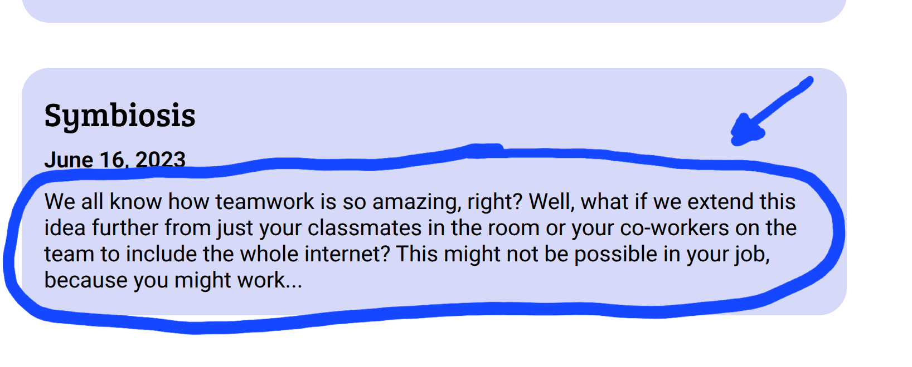
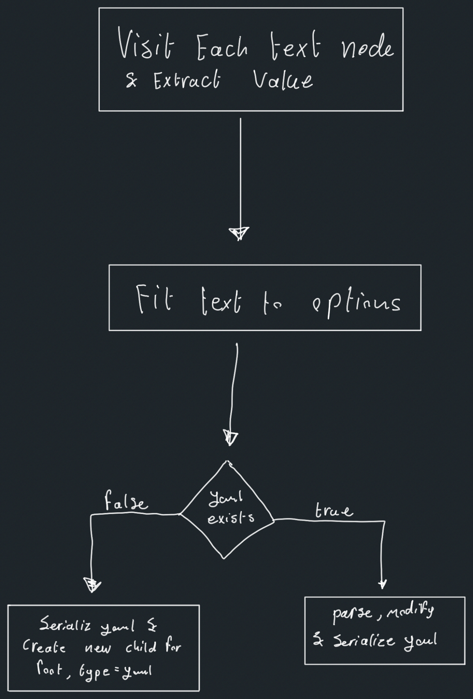

As I was rebuilding my personal website (more on that in the future), I ran across an oddly difficult problem: how do I display a small preview of a blog article under the title? This might seem a simple endeavour, and it should be, but I soon found myself deep in a rabbit hole of markdown parsing and AST manipulation which led me to publishing [my first npm package](https://www.npmjs.com/package/remark-preview-to-frontmatter)… and *it was beautiful*\!

## Why I needed to build a package

My website is statically generated and built with [Astro](https://astro.build/). The blog posts \- including this one \- are written in markdown and compiled by Astro. Astro provides a lot of capability for working with markdown out of the box, including accessing frontmatter and the raw text content of the markdown file. What it does not provide, to my surprise, is a way to access the contents of the file unformatted, which was what I needed to implement this feature. 

At first, I thought about grabbing the raw contents of the markdown file as provided by Astro, then parsing them and removing formatting symbols and comments, but i didn’t like this solution; writing a markdown parser is a whole project of its own, and i could already foresee myself debugging odd issues, trying to figure out where exactly the problem was occurring during the parsing. 

But then I remembered something I came across while reading the Astro docs: I can install and write plugins which interface with Astro when it’s processing markdown. It turns out Astro uses an underlying package called [remark](https://remark.js.org/), and markdown processing is done using that. Perhaps I can find a plugin that would embed some amount of the document as unformatted text in the file’s frontmatter, I thought, but unfortunately, I found none, so faced with all this, I decided that I needed to build my own plugin, and if I’m gonna build something so general like that, I might as well publish it\!

## The action plan

To achieve my goal of developing and publishing a package, I must do a few simple things. Firstly, I must research and understand the system that will use my plugin. Secondly, I need to actually develop the plugin with all its intended features. Lastly, I need to publish the package. This last step includes all the preparation needed beforehand to achieve this. Each of those three steps would introduce me to some novelties which were quite fun to explore.

## The research

The first thing I would need to do is take proper time to research and familiarise myself with the technology I’m using. I decided a chat with an LLM would be a suitable research method, as I was trying to understand an ecosystem and the concepts therein, which woud all be verified anyway when I started coding and downloading dependencies. After a long while, here are my results…

### Unifiedjs and remark

Remark is part of a larger project called [Unifiedjs](https://unifiedjs.com/). Unifiedjs is a project that attempts to unify markup parsing and manipulation efforts by providing standards that may be applied regardless of the underlying format. These standards act as a lowest common denominator, in other words, a common interface. This means that a single package can be used to process many types of markup, because they all share that interface.

Remark is the subproject under unifiedjs, which is concerned with Markdown specifically. Essentially, Remark implements the parsing and output functions of a unifiedjs workflow. [The remark plugin ecosystem](https://github.com/remarkjs/remark/blob/main/doc/plugins.md) has many plugins which manipulate markdown and only markdown, however, since everything still implements unifiedjs standards, general unifiedjs packages can be used with remark.

### Abstract syntax trees (ASTs)

Arguably, the most crucial of the aforementioned unifiedjs standards is [`unist`](https://github.com/syntax-tree/unist): the universal (abstract) syntax tree. But what is an abstract syntax tree? It’s a hierarchical data structure (tree) used to representten u a document writsing a specific syntax. This document could be used for presentation such as .md and .html files, or it could be used for storing machine instructions, like `.py` and `.c` files; indeed, parsing text into an AST is a crucial step for both interpreted and compiled languages. 

[`mdast`](https://github.com/syntax-tree/mdast) is the markdown abstract syntax tree. It’s an implementation of `unist` but more tailored for markdown specifically, and is used to develop remark plugins. For `mdast`, the nodes of the tree represent parts of the document, and the hierarchical nature (much like a browser’s DOM) encodes formatting. Each node in the tree has a type, the most significant of which for my project is `text,` which contains actual text (shocker) that should be visible to the viewer of the markup. It is often the child of formatting nodes, such as `strong`. 

### Plugins 

Plugins in unifiedjs (as far as the scope of this project is concerned) are basically functions which are passed an instance of the `unist` and manipulate it in some way. The unified project includes a lot of utilities for working with Unist; these are package-prefixed `unist-util–`. These utilities include finding a node in a tree, filtering the tree and replacing text stored in the tree. 

As you might have guessed, for remark, the plugins are passed an `mdast` and, in addition to common unist utilities, remark plugins can use mdast utilities, packages prefixed with `mdast-util-`.

And here my goal starts to become more concrete: I need to write a function which manipulates the `mdast` by:

1. Extracting the text from the tree  
2. Appending it to the frontmatter within the special `yaml` node

And this is exactly what I did.

## Putting finger to keyboard

When it came down to it, the algorithm used was quite simple: 

And that’s it. A ridiculously simple algorithm really. Of course that doesn’t mean all the code fit in one module, but still small all things considered. The only unexplained bit of it is the “fit text to options” which asserts the output of the plugin adheres to the options passed in to it. If you would like to learn more about that, the options are [documented on github](https://github.com/mohsen-w-elsisi/remark-preview-to-frontmatter?tab=readme-ov-file#pluginoptions). 

### Testing

While developing the different features of the package, I found myself making modifications in the single source markdown file I was using for testing, then manually inspecting the output each time I tried to add a new feature to see if it worked. In addition to that, I started having worries in the back of my mind that I broke something. When I noticed this repetitive effort and worry, I recognised the remedy: a proper test suite.

A NodeJS test suite is something I have never done before, but I am somewhat familiar with testing since I developed [Anthology’s](https://github.com/mohsen-w-elsisi/Anthology) (a read-it-later app) server package, so it wasn’t that foreign to me. I ended up constructing a suite of tests where every test runs the plugin on a markdown file and checks that the output matches a separate file housing the expected output. I made multiple tests to account for different plugin options and formatting scenarios within the document.

Partway through, comparing the expected and actual output as strings seemed a bad idea, as variations in markdown or yaml syntax may exist yet produce the same visual output when rendered. To circumvent this, I parsed both expected and actual outputs to an mdast and compared the stringified versions of those. 

### Packaging the program

Actually publishing the package to npm, though, was completely novel. The hardest thing I had to get done was pointing to the proper files to correctly set up exports and their type declarations in my `package.json`. After that was done, setting up a `.npmignore` to exclude the typescript `src` and `tests` folders was quite intuitive. Lastly, I made an account on npm and finally ran `npm publish`.

## Everything I have learnt

This project was very enjoyable. Besides learning to prepare a package for publishing, I learnt how to create a general-purpose API for others to use and document said package. I also witnessed the importance of software testing firsthand, even for small projects, and improved my skills in that regard. Lastly, I learnt how to work on a very niche problem in a niche community and reach (in my own estimation) a viable solution.

## Conclusion

So after all that, did the plugin work on the website? No, actually. Astro requires [some specific changes](https://docs.astro.build/en/guides/markdown-content/#modifying-frontmatter-programmatically) to actually detect any changed frontmatter, but a quick fork later, that was all working, thankfully.

Aside from the website, this project allowed me to write code *for* open source, not just code *that* is open source. This was a very new and meaningful experience for me, giving back to the community. Lastly, this project was really a strong learning opportunity which I quite much enjoyed, and I really hope to repeat in the future.
