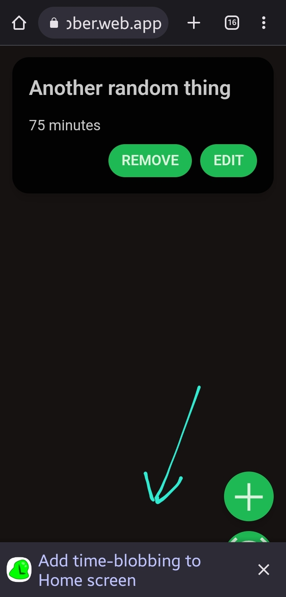

*Note: you won't understand anything unless you read another post called
"the story of tic tac done". So go read that one, then come back here*

A few weeks ago, I shared the story of tic-tac-done. A todo list app
that I was making. That project failed, so in its conclusion I decided
that I to make an app that fixed all the flaws of the original and
didn't fail this time! I called this new app Timbo. I even created a
fancy icon for it:

The app works, but there are a few caveats...

## What is Timbo

Timbo is a timer app that follows the time blobbing framework for
managing time. What is time blabbing? Imagine you have a lot of tasks to
get done, and you don't want any single one taking up too much time.
What do you do? You set a timer for the max time each task could take.
They could end sooner, but they can't take longer.

Timbo lets you list all your tasks and the max times of each, then it
will start the timers one after the other. Of course you can finish the
task early and end the timer prematurely, but once the timer ends you
can't restart it.

## I did what i promised

I avoided all the pitfalls that made me stubble when I was making tic
tac when

-   I made it do one thing and do it very well: facilitate time blobbing
-   I used a pre-built UI library so i could save my time and energy on
    making the app functional
-   I kept my code organised from the start to avoid it toppling over my
    head again

The project went quite smoothly all in all.

## The things the web can't do

The app works perfectly fine on desktop, not on mobile though. Because
mobile phones will try to save battery power, they perform certain
optimisations to limit power consumption, like stopping any websites
from running in the background.

This isn't a problem in most cases, but when a timer needs to be
continuously running, this presents an issue. I did some research and
tried going around the problem, but as of now there is no possible way
to turn off battery optimisation for a web app.

This reveals something about the web platform: no matter how powerful it
is now, native apps are just better. The ability to talk to the OS
directly instead of having a middle man (the browser) lets you do things
you otherwise wouldn't be able to. If this was a native app, I could
request to disable battery optimization for my app.

The middle man is becoming better and better at being able to express
what is asked of him, and I'm hopeful that in the future web apps would
become more capable of communicating these fine details.

## Try it out

[Here's the url for the app](https://time-blobber.web.app/). You can use
it in the browser or install it (not on iphones) by clicking the "add to
homescreen" thingy at the bottom.

